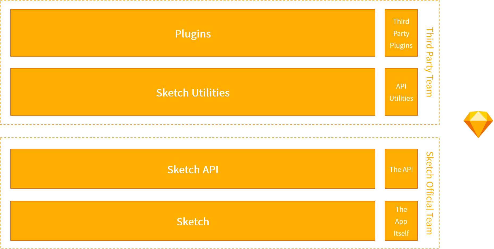
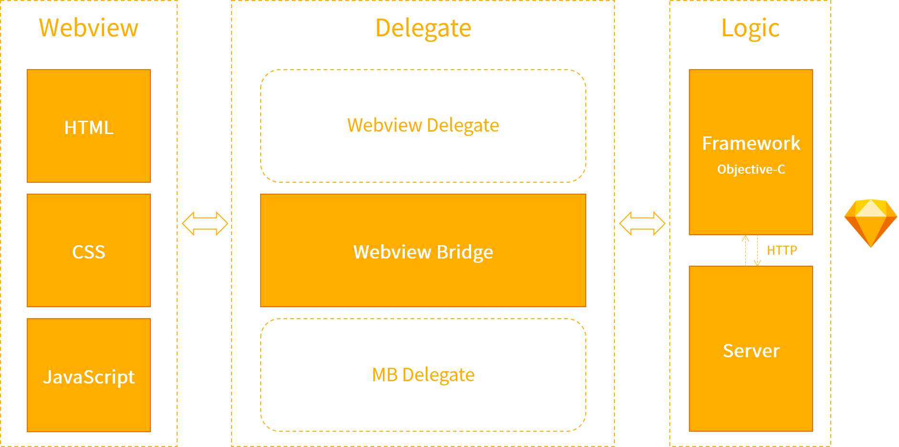

  

# veeui-plugin-sketch

> A Plugin of Sketch for Vee UI Library

## Principle

Due to the underlying plug-in mechanism provided by Sketch, the entire architecture design pattern uses a layered approach combined with the API provided by the toolkit in Sketch for custom feature development.

[The VeeUI Sketch plugin](https://github.com/vleedesigntheory/veeui-plugin-sketch) uses a custom development based on the `skpm` scaffolding provided by Sketch's official website.

## License

[MIT](http://opensource.org/licenses/MIT)

Copyright (c) 2023-present VLeeDesignTheory
